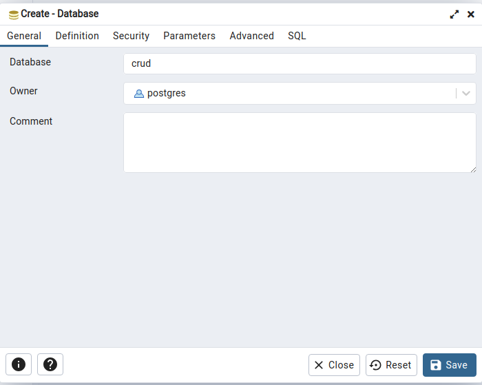

Dokumentasi Setup Website

1. Buat database pada postgresql (melalui pgadmin)

    klik kanan pada tulisan Databases lalu pilih Create > Database
    
    

    ketika muncul pop up, tulis nama database yang akan dibuat yaitu crud, kemudian klik save

    

2. Clone repository

    ```
    git clone https://github.com/Dzalhaqi/test-fastprint.git
    ```

3. Setup virtual env dan install library yang dicatat pada file requirements.txt

    ```
    cd test-fastprint/
    ```

    > windows
    >```
    > python -m venv env && .\env\Scripts\activate
    > ```

    > Unix or MacOS
    >```
    > python3 -m venv env && source env/bin/activate
    > ```

    ```
    pip install -r requirements.txt
    ```

4. Setup model table database pada website dan atur static file

    ```
    python manage.py makemigrations && python manage.py migrate
    ```

    ```
    python manage.py collectstatic
    ```

5. Loaddata json yang sebelumnya sudah diambil 

    ```
    python utils/loaddata.py
    ```

6. Buat superuser admin

    ```
    python manage.py createsuperuser
    ```

7. Running server

    ```
    python manage.py runserver
    ```


Preview Website


